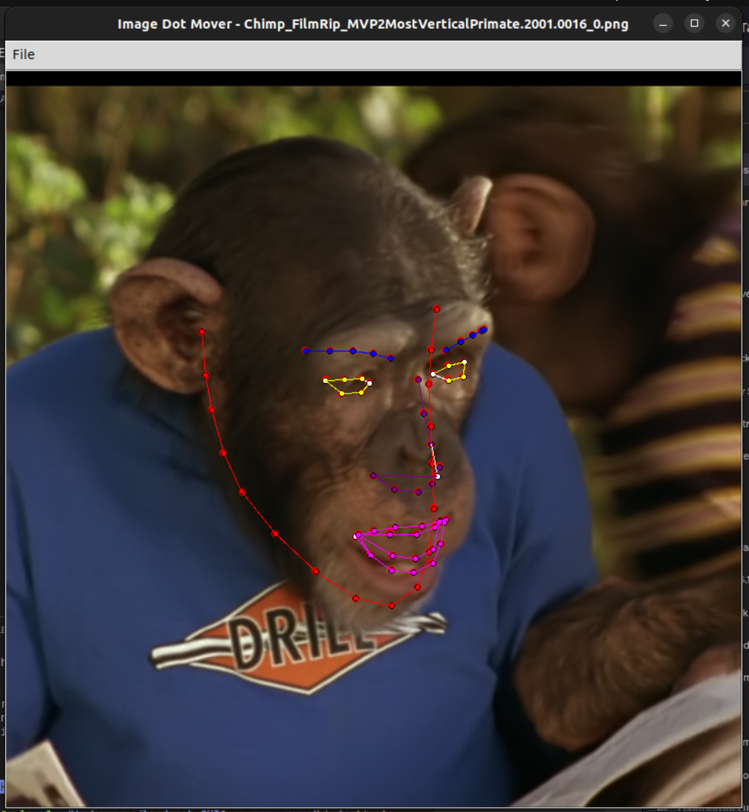
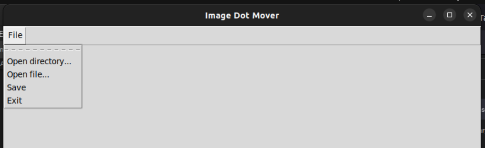

# Landmark GUI

Simple interface for manually annotating face image data (68 landmarks).

## Preview

Controls:
* **Left Arrow** / **Right Arrow** : Previous image / Next image
* **CTRL+S** : Save current landmark to file (overwrite)
* **LeftClick** : Drag a point
* **CTRL+LeftClick** : Drag a group




## Data setup

Image and landmark data should exist in a directory like so:
```
 your_data
 |
 ├─── img_0.png
 ├─── img_0_ldmks.txt
 ├─── img_1.png
 ├─── img_1_ldmks.txt
 ├─── img_2.png
 ├─── img_2_ldmks.txt
 │    ...
```

`img_i_ldmks.txt` encodes the landmark information as 68 coordinate pairs:
```
136.586700 181.368881
139.143250 211.010727
143.046860 235.316269
215.864960 347.593414
...
266.220978 347.455549
```


## Install

```
sudo chmod +x setup.sh
./setup.sh
```

## Usage

Make sure python environment is activated
```
source .venv/bin/activate
```

Launch GUI app
```
python3 main.py
```

Open a data directory:



List of controls:
* **Left Arrow** / **Right Arrow** : Previous image / Next image
* **CTRL+S** : Save current landmark to file (overwrite)
* **LeftClick** : Drag a point
* **CTRL+LeftClick** : Drag a group
